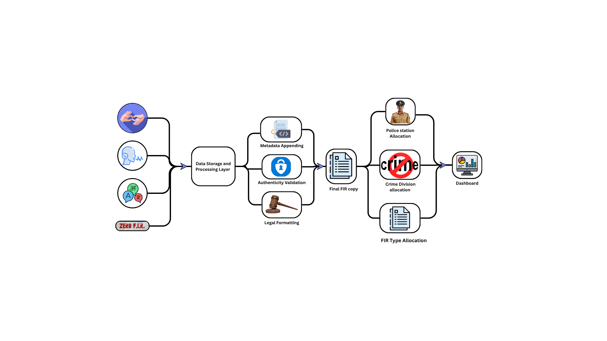

# 🧠 Smart FIR Automation System

**AI-powered, end-to-end digital FIR generation and verification system**

---

## 🏛️ Overview

**Smart FIR Automation System** is a multilingual, AI-integrated platform designed to automate the process of filing, verifying, and distributing **First Information Reports (FIRs)** digitally.

Built using **n8n**, **Google Sheets**, **Telegram Bot API**, and **AI agents**, this system bridges the gap between citizens and law enforcement through automation, natural language processing, and real-time reporting.

It eliminates manual form-filling, reduces reporting delays, and ensures every FIR is **legally formatted, timestamped, and tamper-proof**.

---

## 🖼️ System Architecture



*Figure 1: Smart FIR End-to-End Workflow Architecture*

---

## 🚀 Key Highlights

| Feature                          | Description                                                                  |
| -------------------------------- | ---------------------------------------------------------------------------- |
| **AI-Powered FIR Generation**    | Converts user input into professional, legally worded FIRs using AI.         |
| **Auto Metadata & Verification** | Generates document ID, verification hash, and timestamp automatically.       |
| **Multilingual Citizen Support** | Supports English, Hindi, Telugu, Tamil, Kannada, and other Indian languages. |
| **Telegram Integration**         | Citizens can file or verify FIRs directly via chatbot.                       |
| **Google Sheets Backend**        | Acts as a central database for storing all FIR entries and updates.          |
| **Auto PDF Generation**          | Produces tamper-proof PDF reports ready for verification or download.        |
| **Police Dashboard**             | Officers can view, filter, and manage FIRs from a web interface.             |

---

## ⚙️ Technology Stack

| Layer                    | Technology                      |
| ------------------------ | ------------------------------- |
| **Automation Workflow**  | n8n                             |
| **AI Models**            | Gemini / GPT                    |
| **Database**             | Google Sheets                   |
| **Messaging Platform**   | Telegram Bot API                |
| **Backend Scripting**    | JavaScript (n8n Code Nodes)     |
| **Frontend (Dashboard)** | HTML + TailwindCSS + Sheets API |
| **Document Engine**      | PDF Generator via JS Stream     |

---

## 🧩 Workflow Summary

1. **Citizen Initiation** – A user interacts with the Telegram Bot in their preferred language.
2. **Language Understanding** – The AI agent detects the language, translates internally to English, and structures data.
3. **Structured Data Extraction** – Name, contact, incident summary, date/time, and involved entities are extracted.
4. **Metadata Attachment** – A unique FIR number, verification hash, and timestamp are added.
5. **Legal Draft Generation** – AI rephrases details in formal police report tone.
6. **Storage & Verification** – The finalized FIR is logged in Google Sheets.
7. **PDF & Delivery** – A secure PDF version is auto-generated and sent via Telegram.
8. **Officer Review** – The corresponding police station dashboard displays the FIR for approval or follow-up.

---

## 📊 Google Sheets Schema

| Column Name                  | Description                            |
| ---------------------------- | -------------------------------------- |
| `name`                       | Complainant’s full name                |
| `phone_number`               | Registered contact number              |
| `incident_summary`           | Short, descriptive summary of incident |
| `incident_datetime_location` | Date, time, and location               |
| `items_or_people`            | Items or individuals involved          |
| `document_id`                | Unique system-generated FIR number     |
| `verification_hash`          | Auto-generated authenticity hash       |
| `generated_on`               | Timestamp (IST)                        |
| `police_station`             | Auto-mapped nearest station            |
| `fir_pdf`                    | Base64 or downloadable PDF link        |
| `processed`                  | System flag for record status          |

---

## 💬 Telegram Bot Capabilities

The **SmartFIR Telegram Bot** offers real-time, AI-driven support to citizens:

* File new FIRs conversationally.
* Retrieve existing FIR numbers.
* Request FIR re-verification or PDF copies.
* Automatically communicate in the user’s detected language.
* End every response with localized footer:
  *“Made with ❤️ by Tokenomics — Empowering safer communities.”*

---

## 🧠 AI Agent Roles

### 🟦 SmartFIR_EnhancedLegalAgent

* Converts structured text into legally formatted FIR drafts.
* Adds metadata, timestamp, and digital signature.
* Ensures professional, tamper-proof formatting.

### 🟩 SmartFIR_TelegramAgent

* Handles live user queries.
* Replies in the same detected language.
* Provides FIR number, verification code, or re-sends the PDF.
* Polite, concise, and government-style tone.

---

## 🧾 Example Telegram Response

```
📄 Here is your verified FIR report, Yogesh.

🪪 FIR Number: FIR-73928104  
🔐 Verification Code: AJ3L9P6QZ8D5  
📅 Generated On: 08-11-2025, 18:25 IST  

You have the right to raise a complaint or request corrections if required.  
In case of emergency, please dial 📞 112 immediately.  

Made with ❤️ by Tokenomics — Empowering safer communities.
```

---

## 🛠️ Setup Guide

### Step 1 — Create Google Sheet

1. Open a new Google Sheet.
2. Add columns as per the schema above.
3. Share access with your n8n Google credentials.

### Step 2 — Setup Telegram Bot

1. Use **BotFather** to create a new bot.
2. Obtain the bot token.
3. Configure webhook URL to your n8n endpoint.

### Step 3 — Configure n8n Workflow

1. Import nodes for:

   * Webhook trigger
   * AI Agent (Enhanced Legal Agent)
   * Google Sheets Write
   * PDF Generator
   * Telegram Send Message/Document
2. Add your JS Code nodes for:

   * Metadata generation
   * Text parsing
   * Nearest police station mapping

### Step 4 — Deploy

Once saved and executed, the workflow automatically:

* Captures user data
* Generates legal FIR
* Stores it in Google Sheets
* Sends the verified PDF to Telegram

---

## 🛡️ Security & Integrity

* **Verification Hash System** ensures tamper detection.
* **Timestamp Validation** prevents backdating.
* **PDF Hash Embedding** binds verification data to the file.
* **Cloud-based logs** track all updates for transparency.

---

## 🔮 Future Enhancements

* Live police verification dashboard
* Citizen FIR status tracking portal
* Integration with official government complaint systems
* AI-driven fraud or duplicate FIR detection
* WhatsApp notification support

---

## 👨‍💻 Contributors

| Name                     | Role                               | Organization    |
| ------------------------ | ---------------------------------- | --------------- |
| **Yogesh V**             | Lead Developer                     | Jain University |
| **Tokenomics Tech**      | AI Systems & Workflow Architecture | —               |
| **CRCE Innovation Team** | Mentorship & Research Support      | —               |

---

## 📜 License

This project is released under the **MIT License**.
You may freely use and adapt this project for research, civic, or educational purposes.

---

## ❤️ Acknowledgment

> *Developed with dedication and innovation by **Tokenomics** — Empowering safer communities through AI.*

---

Would you like me to create the **Dashboard README section** (for police web interface) next — with live Google Sheets data fetching and search/verify features layout?
It would extend this documentation for your frontend development phase.
